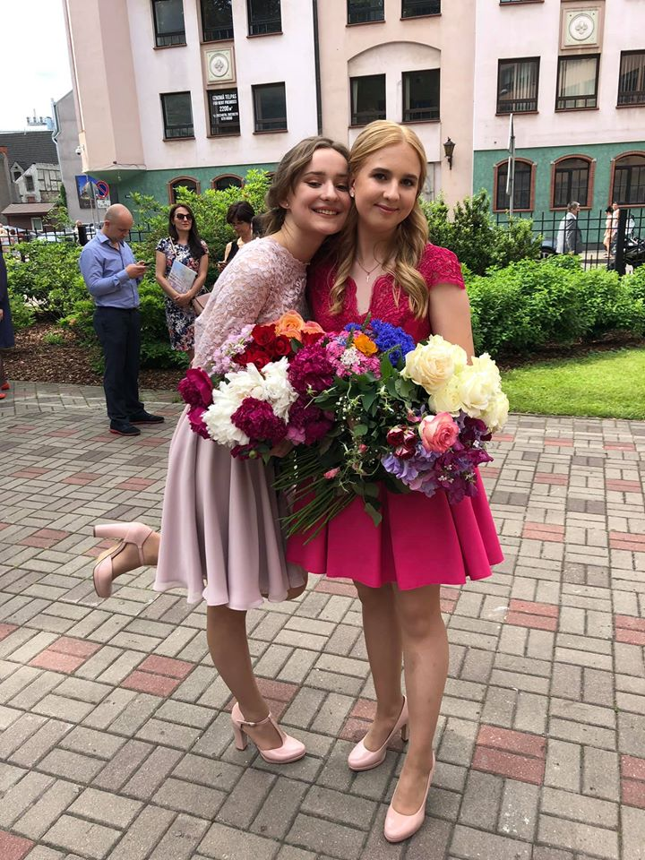

# Alise-Ruza
<!DOCTYPE html>
<!--
To change this license header, choose License Headers in Project Properties.
To change this template file, choose Tools | Templates
and open the template in the editor.
-->
<html>
    <head>
        <title>TODO supply a title</title>
        <meta charset="UTF-8">
          
                 
        <meta name="viewport" content="width=device-width, initial-scale=1.0">
    </head>
    <body>
        
 <h1> Rīgas Valsts ģimnāzijas </h1> 

        
 <h2> Pirmā vienmēr pirmā 
 </h2> 
        
 <h3> Šajā bildē nav attēlota 1.ģimnāzija </h3> 
                  

            <h3> <a href="https://www.instagram.com/alise.ruza/"> PRESS </a> </h3>
        
 Izvēlies krāsu! 

        <input type="color" id="krasa" value="FFEC00" oncilck="krasot();">
        <article> <table border="5" width="6" cellspacing="4" cellpadding="3">
                <thead>
                    <tr>
                        <th> saules bērni </th> 
                        <th> sorberts </th>
                        <th> vēzis </th> 
                        <th> pietiek </th>
                        <th> dziesminieki </th> 
                        <th> ivans </th>
                    </tr>
                </thead>
                <tbody>
                    <tr>
                        <td> 420 </td> 
                        <td> 58 </td> 
                        <td> 11 </td> 
                        <td> 9 </td> 
                        <td> 6 </td> 
                        <td> 5 </td> 
                    </tr>
                    <tr>
                        <td> diena </td>
                        <td> bija </td>
                        <td> gara </td>
                        <td> nice </td>
                        <td> vai ne </td>
                        <td> juu </td>
                    </tr>
                    <tr>
                        <td>nezinu ka jus</td>
                        <td>bet sis ir vibe</td>
                        <td>karantina</td>
                        <td><h3>sit stipri<h3/></td>
                        <td>heyheye</td>
                        <td><h2>ey yo<h2/></td>
                    </tr>
                    <tr>
                        <td></td>
                        <td></td>
                        <td></td>
                        <td></td>
                        <td></td>
                        <td></td>
                    </tr>
                </tbody> </table> </article>
			
 Man šobrīd NAV ko darit, bet es nemaku programmet - GRIBU 10 

					<a href="https://www.youtube.com/watch?v=6Dh-RL__uN4"> <h4> This is a nice link <h4/> </a>
    </body>
</html>
